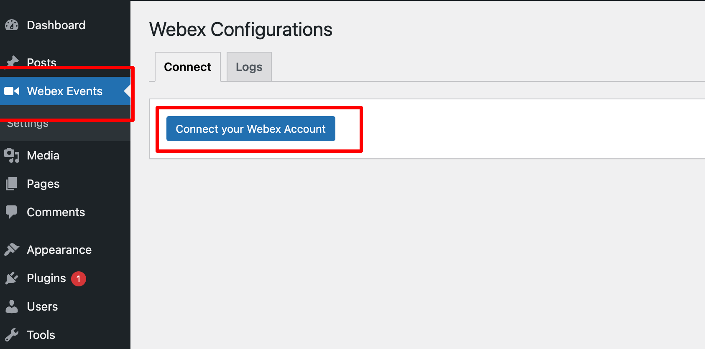
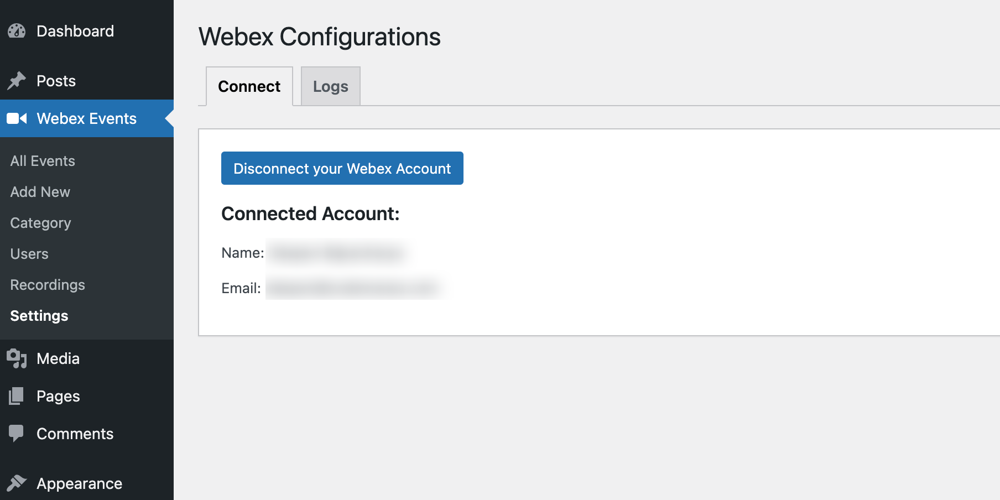
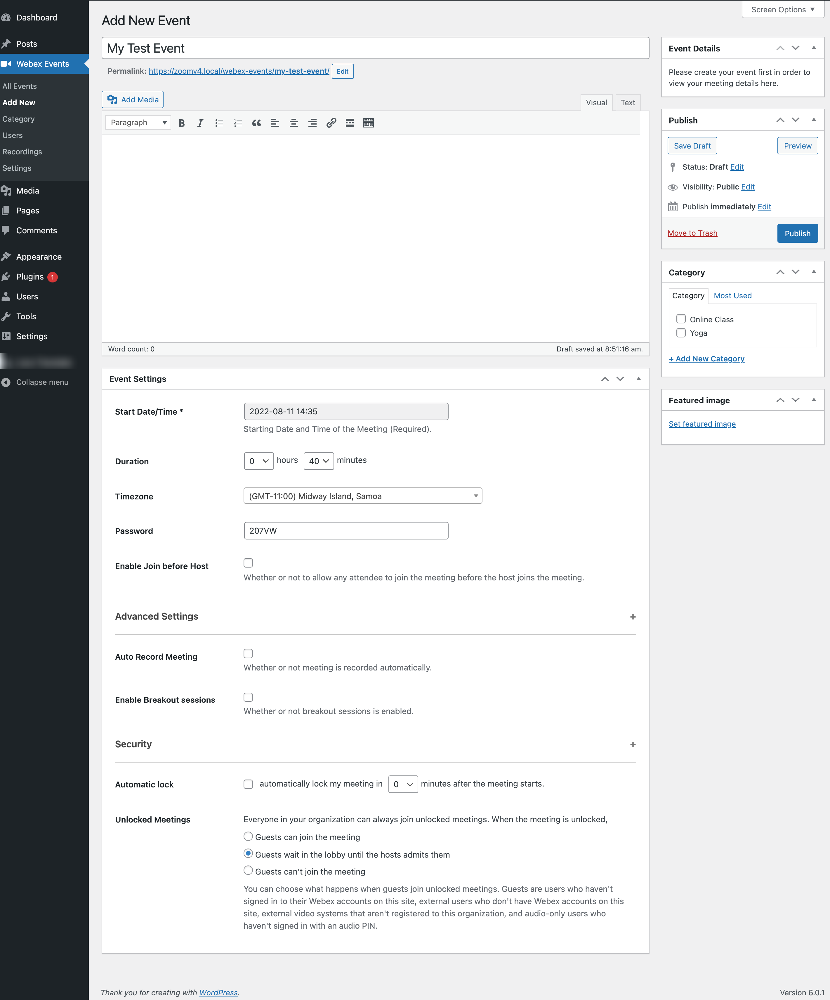
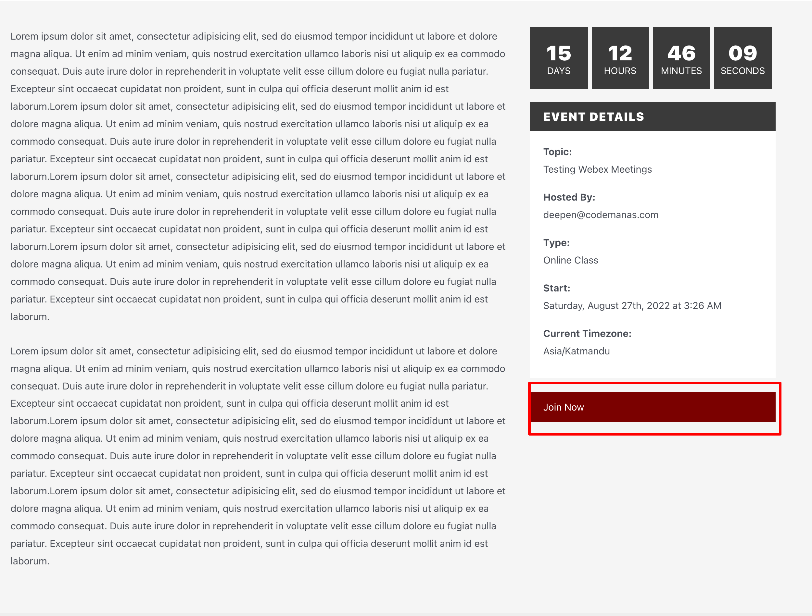

## Connecting your Webex Account

First step is to connect your Webex account with your WordPress site. This allows you to access your meetings, recordings depending on your Webex subscription.

Login to your WordPress site from ( yoursite.com/wp-admin ) and search for a menu item called **"Webex Events"** and goto the page.

Here you will find a **"Connect your Webex Account"** button like shown below.

**Click the button to connect your Webex account.** This will take you to the webex portal - Depending on the account you enter the connection will be made on your WordPress site as well.

After successful connection. You should see your account information displayed. Now, you can create Webex meetings directly from your WordPress dashboard.

## Creating Meetings

You can create your Webex meetings by going to **Webex Events > Add New** section where you would see a WordPress post editor with multiple options like shown below.

When creating a meeting you can use the options that are mostly available by default on your Webex platform. These settings will be added gradually in the future phases.

## Joining Webex Meetings

After you have succesfully created your meeting. You can view your meeting like how you would normally view your webpage in **WordPress**. The frontend view would look something like below image:

Above view can be changed using override functionality from the parent or child theme and the styling may vary depending on the theme that you are using but with click of **Join Now** button your users can join you in your Webex meeting easily.

