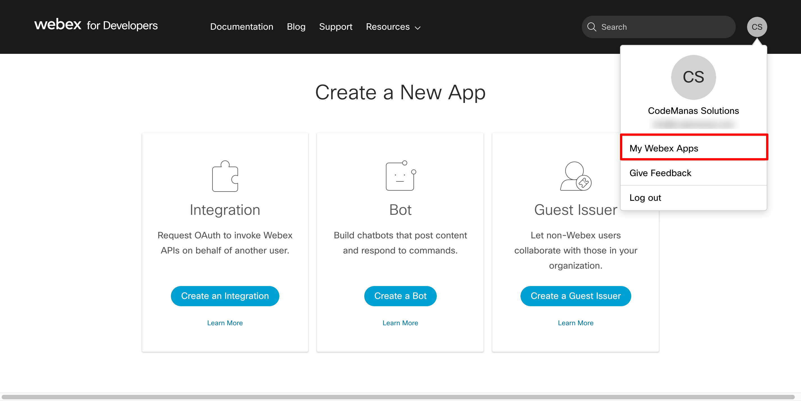
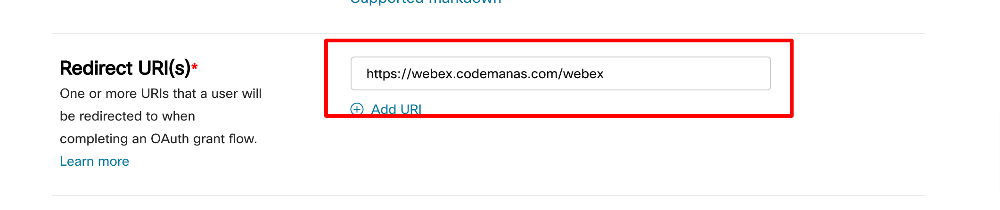
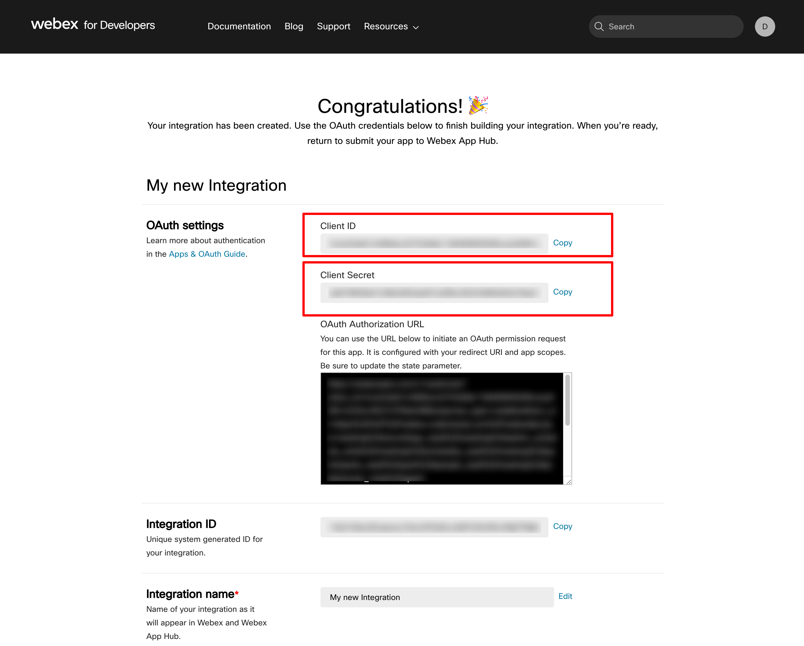
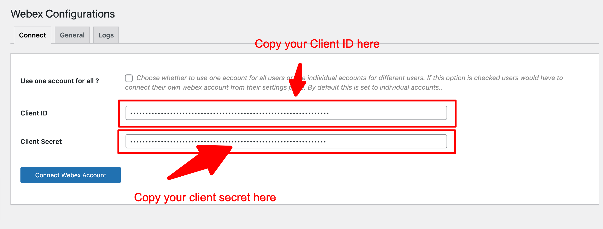

If you want to use your own API Keys instead of connecting through codemanas app then you can do so. In order to add your own API keys first you will need to "**Create a New App**" from webex developer platform.

### Create New App

Goto **developer.webex.com** and login with your webex account. Create a new account if you do not have one yet. Now, after login click on your profile icon at the top righ corner and click on "**My Webex Apps**"

After that you should see a screen like above - Find an option called "**Integration**" and click on **Create an Integration**

After you click the **Create an Integration** button you should see something like below where you should fill in the information based on your preference. 

- **Will this integration use a mobile SDK?** = Set to No
- **Integration Name** = Your Integration Name ( For example: CodeManas App )
- **Icon** = Upload or choose any of the already given ones
- **App Hub Description**  = You can just add a basic description of the app here.
- **REDIRECT URI** = This is a very important step. You redirect URI needs to be set to **https://webex.codemanas.com/webex** - Setting to something different will not work.

### Redirect URI ( IMPORTANT )

This is a very important step. Your redirect URI needs to be set to **https://webex.codemanas.com/webex** - Setting to something different will not work.

### Scopes ( IMPORTANT )

Below are the scopes that you should check or enable. Please note all below scopes must be added in order for the plugin to work properly. Failing to add any one of the scopes described below will break the functionality.

- 'meeting:schedules_read',
- 'meeting:schedules_write',
- 'meeting:recordings_read',
- 'meeting:recordings_write',
- 'meeting:preferences_read',
- 'meeting:preferences_write',
- 'meeting:controls_read',
- 'meeting:controls_write',
- 'meeting:participants_read',
- 'meeting:participants_write',
- 'meeting:admin_schedule_read',
- 'meeting:admin_recordings_read',
- 'meeting:admin_recordings_write',
- 'meeting:admin_schedule_write',
- 'spark:people_read',
- 'spark-admin:people_read',
- 'spark-admin:people_write'

Now after you have added all the scopes and redirect URI click on **Add Integration** to get your API keys.

### API Keys

After you have succesfully created your App, you should be redirected to screen like below where you can get your API keys. Copy the below highlighted keys and goto "**Connecting with WordPress**" step.

### Connecting with WordPress

Goto your **wp-admin > Webex Events > Settings** page and Copy your **client ID** and **Client Secret** highlighted section shown in below image.

Click on **Connect Webex Account** in order to connect with your Webex account.

After successful connection. You should see your account information displayed. Now, you can create Webex meetings directly from your WordPress dashboard.